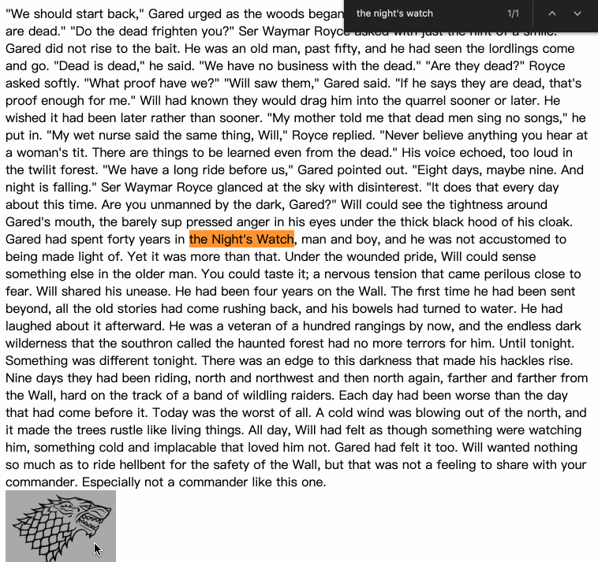
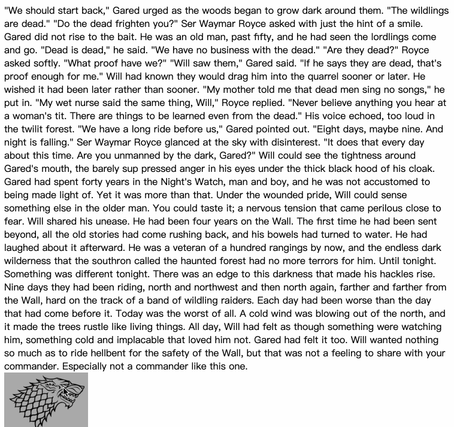

# draggable element in the normal flow

Implement draggable element in **the normal flow** by using the DOM Range API.

--------

The gifs below show the difference of supporting the normal flow or not:

* dragging in the normal flow 

  
* just dragging 

  